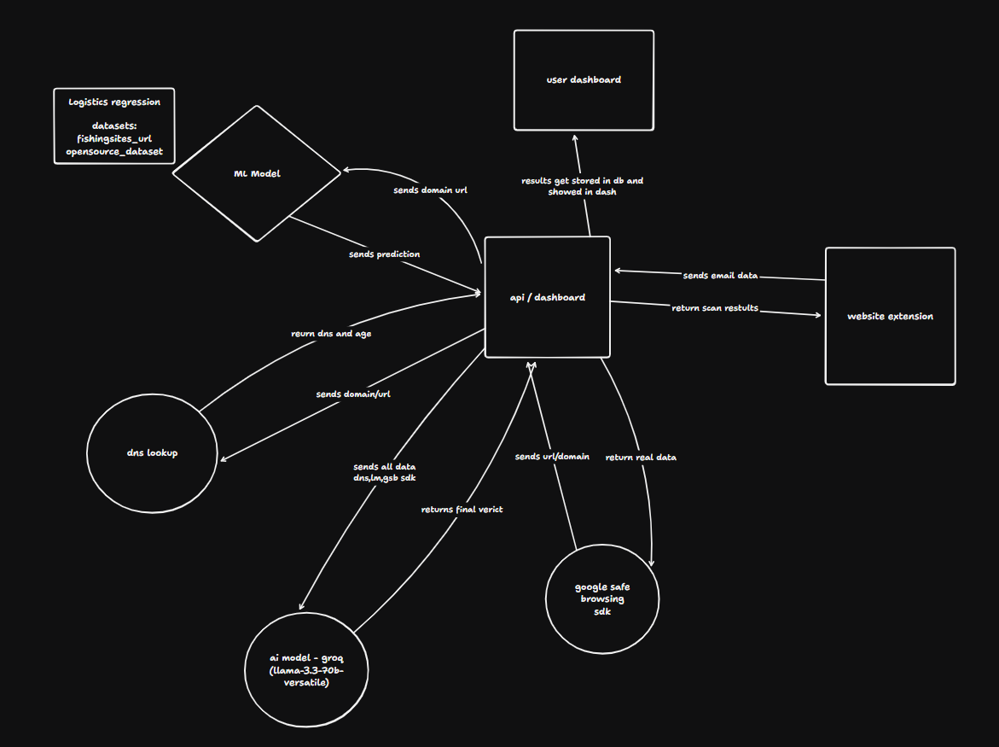

# 🛡️ AI Phishing Detection Assistant

An AI-powered browser-based system that detects phishing emails, malicious links, and suspicious domains in real time using a multi-layered approach.

---

## 🚀 Overview

Phishing attacks are one of the most common cybersecurity threats, tricking users into revealing sensitive information through fake emails and malicious websites.

This project provides a **real-time phishing detection system** that combines:

* Machine Learning (URL classification)
* AI/LLM (Final verdict)
* DNS intelligence (domain verification)
* Google Safe Browsing (threat database)

👉 The system analyzes data from multiple sources and generates a **risk score with explanation** before the user interacts with harmful content.

---

## 🧠 Architecture & Workflow



```text
User → Extension → API → Multi-layer Analysis → LLM Verdict → Response
```

### Flow

1. **Extension**

   * Extracts text, URLs, domain
   * Sends data to API

2. **API (Orchestrator)**

   * Calls multiple services
   * Collects results

3. **Analysis Layers**

   * ML → phishing probability
   * DNS → domain age & records
   * Google API → blacklist check

4. **LLM Verdict**

   * Takes all results as input
   * Generates:

     * Risk level (Low / Medium / High)
     * Explanation
     * Recommendation

5. **Response**

   * Sent back to extension
   * Warning shown to user

---

## 🔥 Features

* Real-time phishing detection
* Multi-layer security
* URL + email scanning
* LLM-based reasoning
* Simple dashboard support

---

## 🛠️ Tech Stack

* **Frontend:** Next.js (Dashboard), React (Extension)
* **Backend:** Next.js API
* **ML:** Python, scikit-learn (Logistic Regression)
* **External:** Google Safe Browsing API
* **DB:** SQLite (MVP)

---

## Installation

**Prerequisites**
- python with uv installed
- node with bun and pnpm installed

**follow the step to completely clone this project**

1. clone the Repository

```bash
git clone https://github.com/Yranshevare/Trust_Inbox.git
cd Trust_Inbox
```
it will download the following project structure
```
Trust_Inbox/ 
├── agent/ # ml model (Python)
├── extension/ # browser extension code (Vite)
└── web/ # extension dashboard with backend (Next)
```
2. install dependencies
```bash
# dashboard
cd web 
bun i

# extension
cd extension
pnpm i

# ml
cd agent
uv sync
```
3. add environment variable
```bash
cd web
```
here create `.env` file and make sure it has following variable:
```js
PORT="3000"
DATABASE_URL="YOUR DB URL"
RESEND_API_KEY="YOUR KEY"
EMAIL_FROM="YOUR EMAIL"
BETTER_AUTH_URL="http://localhost:3000"
GOOGLE_CLIENT_ID="YOUR CLIENT"
BETTER_AUTH_SECRET="YOUR SECRET"
GOOGLE_CLIENT_SECRET="YOUR SECRET"
GOOGLE_SAFE_BROWSING_API_KEY="YOUR KEY"
VT_API_KEY="YOUR KEY"
GOOGLE_GENERATIVE_AI_API_KEY="YOUR KEY"
GROQ_API_KEY="YOUR KEY"
```


4. start server
```bash
# start the ml mode
cd agent
uv run src/main.py

# start backend server
cd web
bun dev
```
5. connect the extension to browser
```bash
# build the extension first
cd extension
pnpm run build
```
now you'll see `dist_chrome` folder generated:
- go to your browser  -> extension -> manage extension -> Load Unpack
- choose this `dist_chrome` folder 
- extension will be loaded into your browser

---

## 🎯 Goal

Prevent phishing attacks by detecting threats **before users take action**.

---
